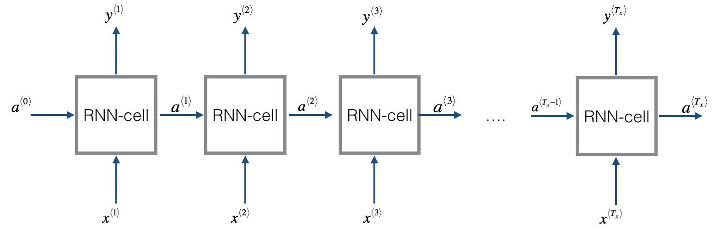
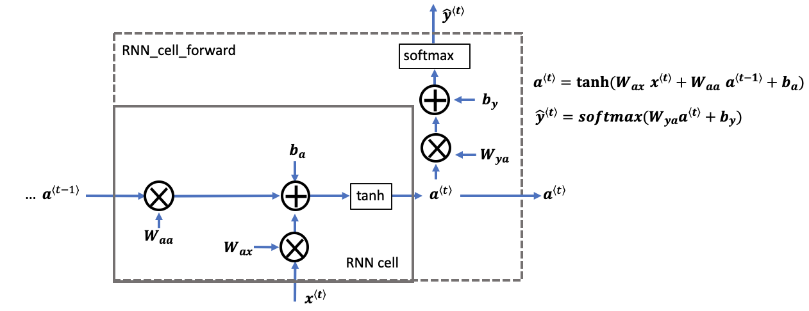
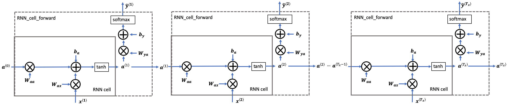
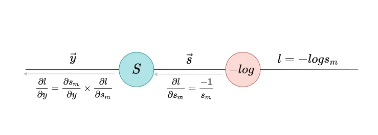
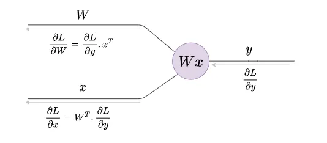
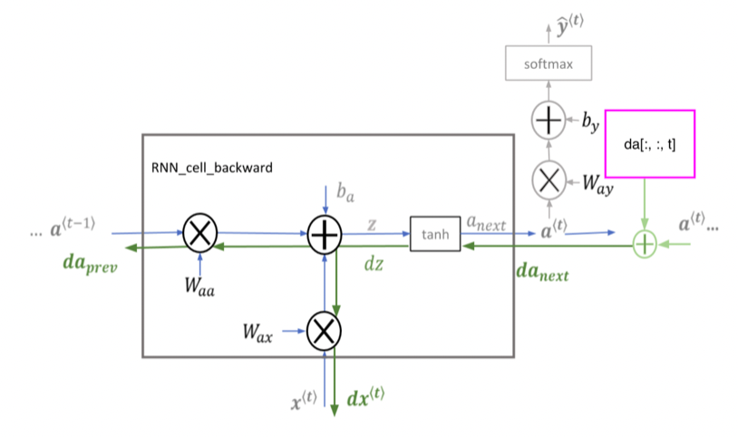
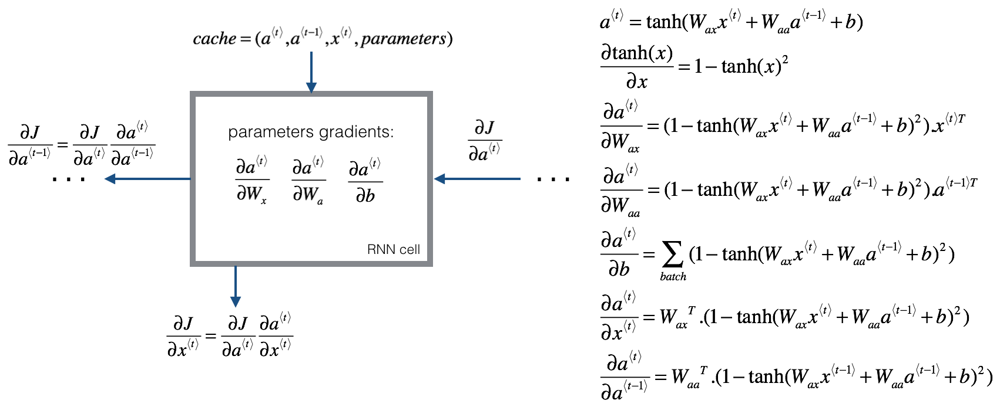
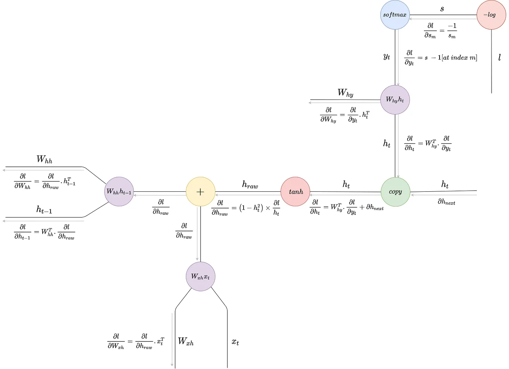

# RNN from Scratch — Derivation & Implementation

A vanilla **Recurrent Neural Network built from scratch in NumPy** — no deep-learning
framework for the model itself. This repository has two halves:

1. **The theory** — a complete, hand-derived account of how an RNN works: the forward
   recurrence, the softmax + cross-entropy gradient, and full **Backpropagation Through
   Time (BPTT)**, with every step shown explicitly and illustrated.
2. **The code** — that derivation turned directly into a readable NumPy implementation,
   trained with BPTT and used to generate text both character-by-character and
   word-by-word.

> Educational project: the goal is to make the mechanics of an RNN explicit and
> readable, not to be fast or state-of-the-art.

---

# Part 1 — How an RNN Works (Derivation)

A complete mathematical derivation of forward propagation and backpropagation through
time (BPTT) for a vanilla RNN, including the softmax gradient, the cross-entropy loss
gradient, and the vector/matrix gradient rules.

## Table of Contents

- [RNN from Scratch — Derivation \& Implementation](#rnn-from-scratch--derivation--implementation)
- [Part 1 — How an RNN Works (Derivation)](#part-1--how-an-rnn-works-derivation)
  - [Table of Contents](#table-of-contents)
  - [1. RNN Architecture Overview](#1-rnn-architecture-overview)
  - [2. Forward Propagation](#2-forward-propagation)
  - [3. Softmax — Definition \& Gradient](#3-softmax--definition--gradient)
    - [Case i: j = i (diagonal)](#case-i-j--i-diagonal)
    - [Case ii: j ≠ i (off-diagonal)](#case-ii-j--i-off-diagonal)
  - [4. Loss Function — Cross-Entropy](#4-loss-function--cross-entropy)
  - [5. Gradient of Loss w.r.t. Logits](#5-gradient-of-loss-wrt-logits)
    - [Case i: j = m](#case-i-j--m)
    - [Case ii: j ≠ m](#case-ii-j--m)
  - [6. Gradient of Vectors and Matrices](#6-gradient-of-vectors-and-matrices)
  - [7. Backpropagation Through Time (BPTT)](#7-backpropagation-through-time-bptt)
    - [Output layer gradients](#output-layer-gradients)
    - [Hidden state gradients](#hidden-state-gradients)
    - [Weight gradients](#weight-gradients)
  - [8. Summary of Gradient Equations](#8-summary-of-gradient-equations)
- [Part 2 — The Code](#part-2--the-code)
  - [Pipeline](#pipeline)
  - [Project structure](#project-structure)
    - [`rnn_scratch.py` — the model](#rnn_scratchpy--the-model)
    - [`utils.py` — data \& inference helpers](#utilspy--data--inference-helpers)
  - [Setup](#setup)
  - [Usage](#usage)
  - [Reference](#reference)

---

## 1. RNN Architecture Overview

A vanilla RNN processes a sequential input `x⟨t⟩` and maintains a hidden state `a⟨t⟩`
that is carried across time steps. The same cell — the same weights — is applied at
every step, and the hidden state is the only channel through which information from the
past reaches the present.



**Parameters (shared across all time steps):**
- `Wax` — weight matrix: input → hidden
- `Waa` — weight matrix: hidden → hidden (recurrent)
- `Wya` — weight matrix: hidden → output
- `ba`, `by` — bias vectors

---

## 2. Forward Propagation

At each time step `t` the cell mixes the current input `x⟨t⟩` with the previous hidden
state `a⟨t-1⟩`, squashes it through `tanh`, and projects the result to an output.



**Hidden state (pre-activation):**
```
a_raw⟨t⟩ = Waa · a⟨t-1⟩ + Wax · x⟨t⟩ + ba
```

**Hidden state (post-activation):**
```
a⟨t⟩ = tanh(a_raw⟨t⟩)
```

**Output logits:**
```
y⟨t⟩ = Wya · a⟨t⟩ + by
```

**Output probabilities (softmax):**
```
ŷ⟨t⟩ = softmax(y⟨t⟩)
```

Running this cell for every step of the sequence — feeding each step's hidden state
into the next — is the full forward pass:



---

## 3. Softmax — Definition & Gradient

The softmax of logit vector `y` at index `i` is:

$$s_i = \frac{e^{y_i}}{\sum_{k=1}^{n} e^{y_k}}$$

We can write this as `s_i = h(y) / g(y)` where:

$$h(y) = e^{y_i}, \qquad g(y) = \sum_{k=1}^{n} e^{y_k}$$

The derivative with respect to `y_j` (quotient rule):

$$\frac{\partial s_i}{\partial y_j} = \frac{h'(y)\, g(y) - g'(y)\, h(y)}{(g(y))^2}$$

We need:

$$\frac{\partial h(y)}{\partial y_j} = h'(y) = e^{y_i} \quad \text{(if } i = j\text{, else 0 → constant)}$$

$$\frac{\partial g(y)}{\partial y_j} = \frac{\partial}{\partial y_j} \sum_{k=1}^{n} e^{y_k} = e^{y_j}$$

### Case i: j = i (diagonal)

When `i = j`, `h(y) = e^{y_i}` and `g'(y) = e^{y_i}`:

$$\frac{\partial s_i}{\partial y_j} = \frac{e^{y_i} \cdot \sum e^{y_k} - e^{y_i} \cdot e^{y_i}}{(\sum e^{y_k})^2}$$

$$= \frac{e^{y_i}}{\sum e^{y_k}} \left(1 - \frac{e^{y_j}}{\sum e^{y_k}}\right)$$

$$\boxed{\frac{\partial s_i}{\partial y_j} = s_i (1 - s_j)} \quad \text{when } j = i$$

### Case ii: j ≠ i (off-diagonal)

When `i ≠ j`, `h'(y) = 0` (since `e^{y_i}` does not depend on `y_j`):

$$\frac{\partial s_i}{\partial y_j} = \frac{0 - e^{y_j} \cdot e^{y_i}}{(\sum e^{y_k})^2} = -s_i \cdot s_j$$

$$\boxed{\frac{\partial s_i}{\partial y_j} = -s_i s_j} \quad \text{when } j \neq i$$

**Combined Jacobian of softmax:**

$$\frac{\partial s_i}{\partial y_j} = \begin{cases} s_i(1 - s_j) & \text{if } j = i \\ -s_i s_j & \text{if } j \neq i \end{cases}$$

---

## 4. Loss Function — Cross-Entropy

For a correct class index `m`, the cross-entropy loss is:

$$\ell = -\log(s_m)$$

where:

$$s_m = \frac{e^{y_m}}{\sum_{k} e^{y_k}}$$

The gradient with respect to `s_m`:

$$\frac{\partial \ell}{\partial s_m} = -\frac{1}{s_m}$$

---

## 5. Gradient of Loss w.r.t. Logits

By the chain rule, the loss gradient flows back through the softmax to the logits:



$$\frac{\partial \ell}{\partial y_j} = \frac{\partial \ell}{\partial s_m} \cdot \frac{\partial s_m}{\partial y_j}$$

### Case i: j = m

Using `∂s_m/∂y_j = s_m(1 - s_j)`:

$$\frac{\partial \ell}{\partial y_j} = -\frac{1}{s_m} \cdot s_m(1 - s_j) = -(1 - s_j) = s_j - 1$$

$$\boxed{\frac{\partial \ell}{\partial y_j} = s_m - 1} \quad \text{if } j = m$$

### Case ii: j ≠ m

Using `∂s_m/∂y_j = -s_m · s_j`:

$$\frac{\partial \ell}{\partial y_j} = -\frac{1}{s_m} \cdot (-s_m \cdot s_j) = s_j$$

$$\boxed{\frac{\partial \ell}{\partial y_j} = s_j} \quad \text{if } j \neq m$$

**Combined:**

$$\frac{\partial \ell}{\partial y_j} = \begin{cases} s_m - 1 & \text{if } j = m \\ s_j & \text{if } j \neq m \end{cases}$$

> **Intuition:** This is simply `ŷ - one_hot(true_label)` — the predicted probability
> vector minus the ground-truth indicator. Elegant! This is exactly the
> `y_pred - Y` you'll see in the code.

---

## 6. Gradient of Vectors and Matrices

For a linear transformation `y = Wx`, the gradients are:



$$\frac{\partial L}{\partial W} = \frac{\partial L}{\partial y} \cdot x^T$$

$$\frac{\partial L}{\partial x} = W^T \cdot \frac{\partial L}{\partial y}$$

**Intuition:** The weight gradient is the outer product of the upstream gradient and the
input. The input gradient backpropagates the upstream error through the transpose of the
weight matrix. These two rules are all we need to differentiate every linear step in the
RNN.

---

## 7. Backpropagation Through Time (BPTT)

BPTT applies the chain rule to the unrolled network, walking the sequence in reverse and
accumulating gradients into the shared weights. A single cell's backward pass routes the
incoming hidden-state gradient through `tanh` and out to each parameter and to the
previous step:



### Output layer gradients

Given `y⟨t⟩ = Wya · a⟨t⟩ + by`:

$$\frac{\partial L}{\partial y^{\langle t \rangle}} = \hat{y}^{\langle t \rangle} - \mathbf{1}[\text{true label}] \quad \text{(from softmax + cross-entropy above)}$$

$$\frac{\partial L}{\partial W_{ya}} = \frac{\partial L}{\partial y^{\langle t \rangle}} \cdot (a^{\langle t \rangle})^T$$

$$\frac{\partial L}{\partial a^{\langle t \rangle}}\bigg|_{\text{from output}} = W_{ya}^T \cdot \frac{\partial L}{\partial y^{\langle t \rangle}}$$

### Hidden state gradients

The total gradient at `a⟨t⟩` receives contributions from both the current output and the
next time step:

$$\frac{\partial L}{\partial a^{\langle t \rangle}} = W_{ya}^T \cdot \frac{\partial L}{\partial y^{\langle t \rangle}} + W_{aa}^T \cdot \frac{\partial L}{\partial a_{\text{next}}}$$

Through the tanh activation (where `a⟨t⟩ = tanh(a_raw⟨t⟩)`):

$$\frac{\partial L}{\partial a_{\text{raw}}^{\langle t \rangle}} = \frac{\partial L}{\partial a^{\langle t \rangle}} \cdot (1 - (a^{\langle t \rangle})^2)$$

since `d/dx [tanh(x)] = 1 - tanh²(x)`.

### Weight gradients

$$\frac{\partial L}{\partial W_{aa}} = \frac{\partial L}{\partial a_{\text{raw}}^{\langle t \rangle}} \cdot (a^{\langle t-1 \rangle})^T$$

$$\frac{\partial L}{\partial W_{ax}} = \frac{\partial L}{\partial a_{\text{raw}}^{\langle t \rangle}} \cdot (x^{\langle t \rangle})^T$$

$$\frac{\partial L}{\partial a^{\langle t-1 \rangle}} = W_{aa}^T \cdot \frac{\partial L}{\partial a_{\text{raw}}^{\langle t \rangle}}$$

Collecting every per-cell parameter gradient, expanded through the `tanh`:



The gradient flows back in time via `a⟨t-1⟩`, enabling the RNN to learn long-range
dependencies — in theory. In practice the repeated multiplication by `Waa` leads to the
**vanishing / exploding gradient problem**.

Putting the whole computational graph together — from the loss through softmax,
cross-entropy, the output projection, the `tanh`, and back to `Wxh`, `Whh` and the
previous hidden state — gives the complete BPTT picture:



---

## 8. Summary of Gradient Equations

| Quantity | Gradient |
|---|---|
| Softmax `∂sᵢ/∂yⱼ` (j=i) | `sᵢ(1 − sⱼ)` |
| Softmax `∂sᵢ/∂yⱼ` (j≠i) | `−sᵢsⱼ` |
| Loss `∂ℓ/∂yⱼ` (j=m) | `sₘ − 1` |
| Loss `∂ℓ/∂yⱼ` (j≠m) | `sⱼ` |
| `∂L/∂Wya` | `(∂L/∂y) · aᵀ` |
| `∂L/∂a` (from output) | `Wyaᵀ · (∂L/∂y)` |
| `∂L/∂a_raw` | `(∂L/∂a) · (1 − a²)` |
| `∂L/∂Waa` | `(∂L/∂a_raw) · a⟨t−1⟩ᵀ` |
| `∂L/∂Wax` | `(∂L/∂a_raw) · x⟨t⟩ᵀ` |
| `∂L/∂a⟨t−1⟩` | `Waaᵀ · (∂L/∂a_raw)` |


---

# Part 2 — The Code

The implementation turns the derivation above directly into NumPy. The network is
trained with full BPTT and used to generate text both character-by-character and
word-by-word. The accompanying notebook also compares several word-embedding strategies
(Word2Vec, pre-trained GloVe, FastText) and a pre-trained Transformer (BERT) as
encoders.

## Pipeline

```
raw text → vocabulary → sliding-window sequences → train RNN (BPTT) → predict / generate
```

- **Character model** — inputs are one-hot character vectors; the RNN learns surface
  character statistics and generates text one character at a time.
- **Word model** — inputs are dense word-embedding vectors (Word2Vec / GloVe /
  FastText); the RNN predicts a probability distribution over the vocabulary and
  generates text one word at a time.

## Project structure

```
RNN/
├── rnn_scratch.py              # the RNN class: forward pass, loss, BPTT, training loop
├── utils.py                    # data prep (generate_dataset) + inference (predict_next, generate)
├── rnn_building_scratch.ipynb  # end-to-end walkthrough: char model, word models, BERT encoder
├── Images/                     # diagrams used in this README
├── requirements.txt            # Python dependencies
└── README.md
```

### `rnn_scratch.py` — the model

`RNN` carries a hidden state `a` across `T_x` time steps and is trained with plain
gradient descent over the gradients accumulated by BPTT. Each method maps onto a section
of the derivation above.

| Method | Role | Derivation |
| --- | --- | --- |
| `initialize_parameters` | small random weights `Wax, Waa, Wya` and zero biases `ba, by` | §1 |
| `rnn_cell_forward` | one time step: `a_next = tanh(Wax·x + Waa·a_prev + ba)`, then softmax/linear output | §2 |
| `rnn_forward` | run the recurrence over the whole sequence | §2 |
| `compute_loss` | cross-entropy (classification) or MSE (regression) | §4 |
| `rnn_cell_backward` / `rnn_backward` | backprop one step / through time, with gradient clipping | §5–§7 |
| `update_parameters` | one gradient-descent step | — |
| `train` | the full loop: forward → loss → backward → update | — |

It supports two tasks:

- `task="classification"` — softmax output + cross-entropy loss (one-hot targets).
- `task="regression"` — linear output + mean-squared-error loss (real-valued targets).

In both cases the per-step output gradient reduces to `y_pred - Y`, exactly the
`ŷ − y_true` derived in §5.

### `utils.py` — data & inference helpers

- `generate_dataset(...)` — slides a window of length `T_x` over the corpus and builds
  the `(n_x, m, T_x)` input and `(n_y, m, T_x)` target tensors, in either character or
  word mode.
- `predict_next(...)` — one token in, the single most likely next token out (argmax).
- `generate(...)` — autoregressive generation, optionally sampling from the predicted
  distribution for more varied output.

**Tensor convention** used throughout:

| Symbol | Meaning |
| --- | --- |
| `n_x` | input feature size (vocab size for chars, vector size for words) |
| `n_y` | output feature size (vocab size) |
| `m`   | number of training sequences |
| `T_x` | time steps per sequence |

## Setup

```bash
# (recommended) create and activate a virtual environment
python -m venv .venv
source .venv/bin/activate        # Windows: .venv\Scripts\activate

# install dependencies
pip install -r requirements.txt

# register the environment as a Jupyter kernel (optional)
python -m ipykernel install --user --name=rnn-env --display-name="Python (rnn-env)"
```

> The notebook downloads pre-trained embeddings/models (GloVe via `gensim.downloader`,
> BERT via `transformers`) on first run, so the first execution needs an internet
> connection and some disk space.

## Usage

Open the notebook for the full walkthrough:

```bash
jupyter notebook rnn_building_scratch.ipynb
```

Or use the modules directly — character-level example:

```python
from rnn_scratch import RNN
from utils import generate_dataset, predict_next, generate

text = "your training corpus here ..."

# build one-hot character sequences
X, Y, char_to_index, index_to_char = generate_dataset(
    text, T_x=10, is_char=True, word_vectors=[], seq_length=25
)

# train
model = RNN(X, Y, n_a=100, learning_rate=0.001, iterations=2000)
model.train()

# generate
print(predict_next(model, char_to_index, index_to_char, seed_word="M", is_char=True))
print(generate(model, char_to_index, index_to_char, seed_word="A", num_words=100, is_char=True))
```

Word-level example (using gensim word vectors as the encoder):

```python
from gensim.models import Word2Vec

sentences = [s.split() for s in corpus_lines]
words = [w for s in sentences for w in s]
w2v = Word2Vec(sentences, vector_size=100, window=5, min_count=1, sg=1).wv

X, Y, vocab_to_index, index_to_vocab = generate_dataset(words, T_x=5, is_char=False, word_vectors=w2v)
model = RNN(X, Y, n_a=100, learning_rate=0.01, iterations=2000, task="classification")
model.train()

print(predict_next(model, w2v, index_to_vocab, "Machine"))
print(generate(model, w2v, index_to_vocab, seed_word="Machine", num_words=10, sample=True))
```


---

## Reference

The architecture diagrams and the overall framing of the forward/backward passes follow
the **[DeepLearning.AI Sequence Models course](https://www.coursera.org/learn/nlp-sequence-models)**
on Coursera (taught by Andrew Ng). The from-scratch NumPy implementation and the
hand-worked gradient derivations in this repository are built on the notation and
intuition from that course.
